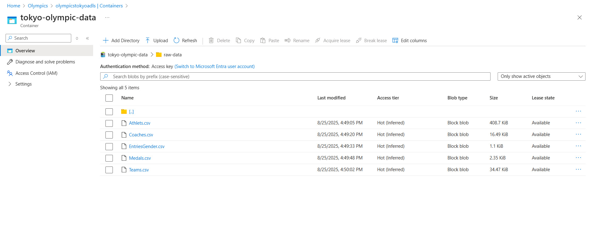
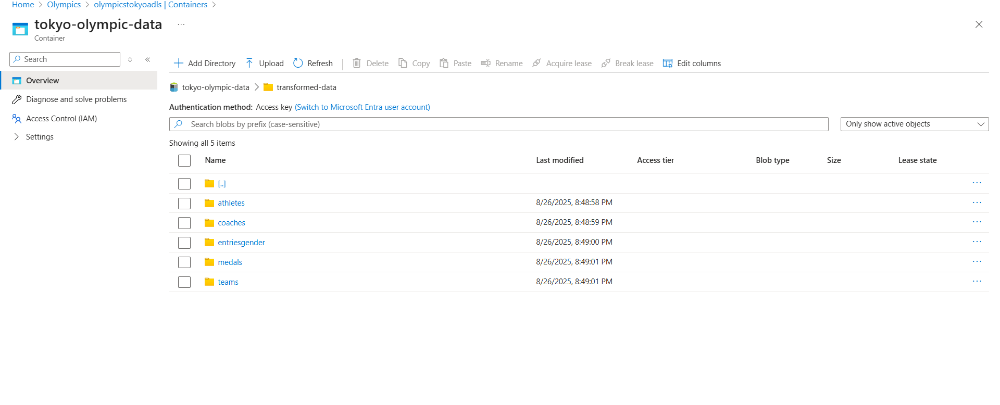
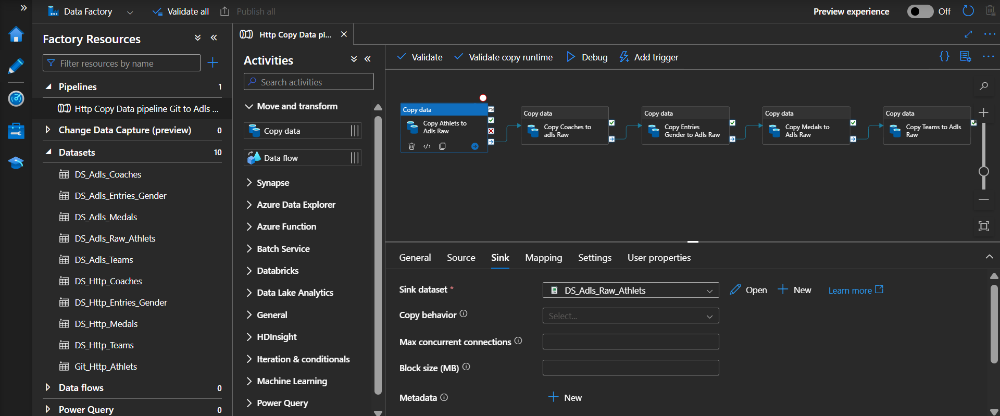
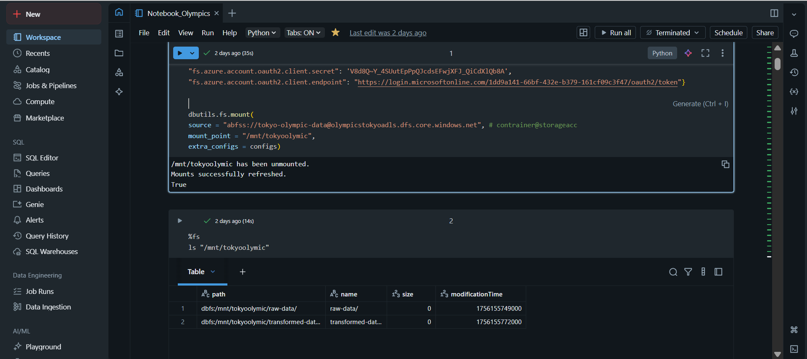
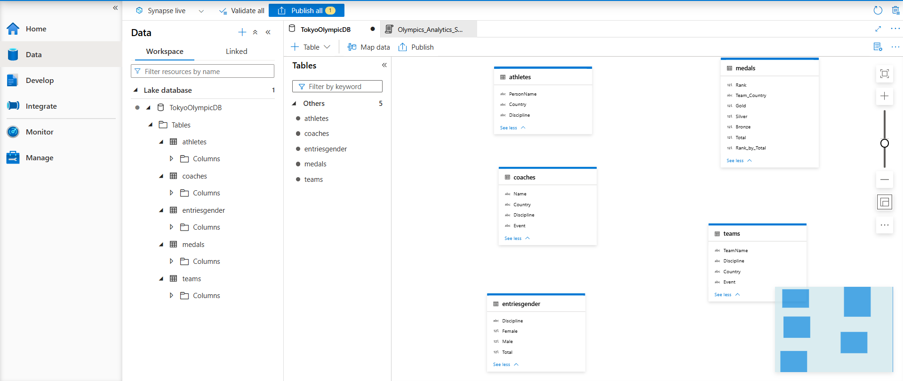
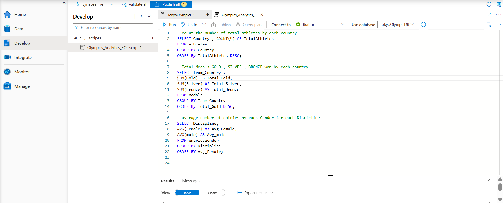

# Tokyo-Olympic-Azure-Data-Engineer  

This project demonstrates how to build an end-to-end **Azure Data Engineering** solution using the **Tokyo Olympics dataset** from Kaggle. The workflow covers ingestion, transformation, warehousing, and reporting using Azure services and Power BI.  

---

## Dataset  

You can find the dataset here:  
 [Tokyo Olympics 2021 Dataset on Kaggle](https://www.kaggle.com/datasets/arjunprasadsarkhel/2021-olympics-in-tokyo)  

---

## Project Workflow  

### 1. Repository & Dataset Setup  
- Created a GitHub repo and uploaded the dataset for version control.  

### 2. Azure Resource Setup  
- Created a **Resource Group** called `Olympics`.  
    

- Created a **Storage Account**: `olympicstokyoadls`.  
- Added a **container**: `tokyo-olympic-data` with two folders:  
  - `raw-data` → stores raw data files.  
      
  - `transformed-data` → stores cleaned/transformed data.  
      

### 3. Data Ingestion (Azure Data Factory)  
- Created a Data Factory named **`krish-olympic-factory`**.  
- Built a pipeline (`Data_Factory_Pipeline.png`) to load data from GitHub (HTTP source) into ADLS Gen2 `raw-data` folder using **Copy Activity**.  
- Linked services were configured for HTTP source and ADLS sink.  

  

### 4. Data Transformation (Azure Databricks)  
- Created a Databricks workspace: **`olympic-databricks-krish`**.  
- Configured clusters and created notebooks for data processing.  
- Used **PySpark** for transformations:  
  - Read raw data from ADLS Gen2.  
  - Applied cleansing and business transformations.  
  - Wrote output back into the `transformed-data` folder.  

Notebook Screenshot:  
  

Full notebook export:  
 [Notebook_Olympics - Databricks.html](Notebook_Olympics%20-%20Databricks.html)  

### 5. Data Warehouse (Azure Synapse Analytics)  
- Created Synapse workspace: **`tokyo-olympics-synapse-kris`**.  
- Pulled transformed data from ADLS Gen2.  
- Created **Lakehouse tables** for analytics and reporting.  

  
  

### 6. Visualization (Power BI)  
- Connected Synapse tables to **Power BI**.  
- Built dashboards for analysis and reporting on Olympic data.  

---

## Architecture  

The high-level architecture of this project:  

  

---

## Tech Stack  

- **Azure Cloud)**
- **SQL**
- **Python**  
- **Azure Data Lake Storage Gen2 (ADLS Gen2)**
- **Azure Data Factory (ADF)**  
- **Azure Databricks (PySpark)**  
- **Azure Synapse Analytics**  
- **Power BI**  
- **GitHub (Version Control)**  

---

✅ With this pipeline, the dataset flows seamlessly from **Raw → Transformed → Warehouse → Dashboards**, ensuring scalability, governance, and reusability.  
